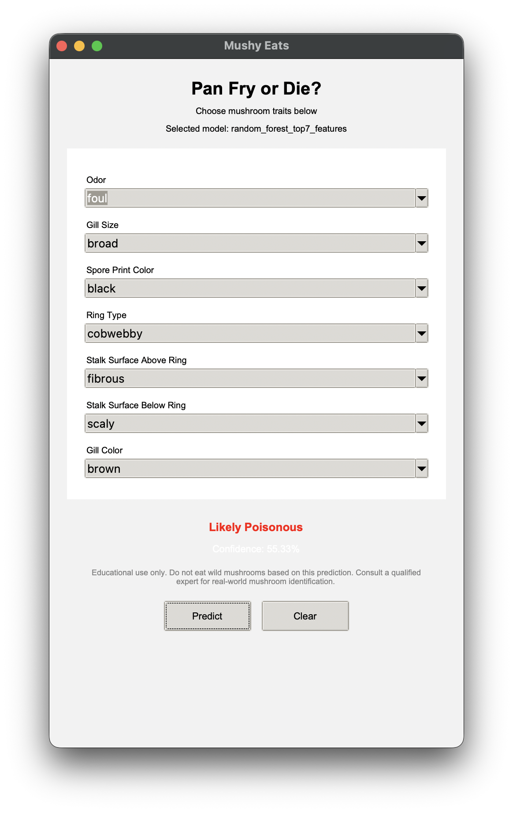

# Evaluating Mushroom Edibility Using Machine Learning Models

This project showcases the development of a Python-based machine learning system for classifying several North American species of gilled mushrooms using physical sample descriptions to predict their edibility. Feature analysis is used to identify the most influential characteristics in the dataset, and multiple model types are compared to evaluate their accuracy, efficiency, and suitability for specific use cases. The project follows the machine learning development process, from dataset exploration and preprocessing to model selection, validation, and performance analysis. Trade-offs among model complexity, interpretability, and efficiency are discussed, along with considerations for scalability and future improvements. This work builds, deploys, and demonstrates a mushroom classification application using various machine learning techniques. 

The final application allows a user to enter a small set of important mushroom characteristics and receive a model prediction.

> **Safety Notice:** This project is for educational and demonstration purposes only. Do not eat wild mushrooms based on this application or model prediction. Real-world mushroom identification should be performed by a qualified expert.

---

## Project Information

| Name | Value |
|:---|:---|
| **Course** | CSCI 425 – Python Machine Learning |
| **Section** | 1 |
| **Semester** | Spring 2026 |
| **Project Title** | Evaluating Mushroom Edibility Using Machine Learning Models |
| **Due Date** | 11-May-2026 |
| **Status** | Complete |
| **Repository** | https://github.com/Colin123432/PYML-FinalProject |
| **Primary Project Folder** | `mushroom-models-application/` |

---

## Team Members

| Name | GitHub Username |
|:---|:---|
| Michael A. Nuttall | `manuttall` |
| Colin Duckworth | `Colin123432` |
| Colten Ross |  |

---

## Dataset

This project uses the mushroom classification dataset from Kaggle:

**Dataset:** [Mushroom Classification – UCI Mushroom Dataset](https://www.kaggle.com/datasets/uciml/mushroom-classification)

The dataset contains physical descriptions of mushrooms, including features such as odor, gill size, spore print color, ring type, stalk surface, gill color, habitat, and bruising. The target column is:

| Target Value | Meaning |
|:---|:---|
| `e` | Edible |
| `p` | Poisonous |

The dataset contains approximately 8,124 mushroom samples with a nearly balanced target distribution:

| Class | Count |
|:---|---:|
| Edible | 4,208 |
| Poisonous | 3,916 |

---

## Project Goals

The goals of this project were to:

1. Build a machine learning system that predicts whether a mushroom is edible or poisonous.
2. Compare multiple model types, beginning with simple baselines and moving to stronger models.
3. Use modular Python files instead of relying only on a single notebook.
4. Perform preprocessing for categorical data, including missing-value handling and one-hot encoding.
5. Identify the most significant mushroom features using feature analysis.
6. Test different validation settings, including train/test splits and stratified k-fold cross-validation.
7. Evaluate model performance using accuracy, balanced accuracy, precision, recall, F1 score, and ROC AUC.
8. Create charts, reports, and explainability outputs.
9. Select a compact model suitable for a user-facing GUI application.
10. Build and demonstrate a Tkinter application that uses the trained model.

---

## Repository Structure

```text
PYML-FinalProject/
├── README.md
├── assets/
│   └── app-running.png
├── showcase-grades/
│   ├── IMG_9633.jpg
│   └── IMG_9634.jpg
└── mushroom-models-application/
    ├── app.py
    ├── run_all.py
    ├── run_validation_sweeps.py
    ├── requirements.txt
    ├── data/
    │   └── raw/
    │       └── mushrooms.csv
    ├── models/
    │   ├── dummy/
    │   ├── logistic_regression/
    │   ├── decision_tree/
    │   ├── random_forest/
    │   └── xgboost/
    ├── src/
    │   ├── config.py
    │   ├── data_io.py
    │   ├── evaluation.py
    │   ├── experiment.py
    │   ├── feature_engineering.py
    │   ├── model_factories.py
    │   ├── plotting.py
    │   ├── preprocessing.py
    │   ├── significance.py
    │   └── sweeps.py
    └── outputs/
        ├── figures/
        ├── metrics/
        ├── models/
        ├── predictions/
        └── reports/
```

---

## Requirements

This project requires Python 3.10 or newer.

The main Python packages are listed in:

```text
mushroom-models-application/requirements.txt
```

Major dependencies include:

- `pandas`
- `numpy`
- `scikit-learn`
- `scipy`
- `matplotlib`
- `seaborn`
- `xgboost`
- `shap`
- `joblib`

Tkinter is also required for the GUI. Tkinter is included with many Python installations, but some systems may require it to be installed separately.

---

## How to Run the Application

### 1. Clone the Repository

```bash
git clone https://github.com/Colin123432/PYML-FinalProject.git
cd PYML-FinalProject
```

### 2. Move into the Application Folder

```bash
cd mushroom-models-application
```

### 3. Create a Virtual Environment

On macOS or Linux:

```bash
python3 -m venv .venv
source .venv/bin/activate
```

On Windows:

```bash
python -m venv .venv
.venv\Scripts\activate
```

### 4. Install Requirements

```bash
pip install -r requirements.txt
```

### 5. Run the GUI Application

```bash
python app.py
```

The application loads the saved machine learning pipeline from the `outputs/models/` folder. The selected application model is:

```text
random_forest_top7_features
```

This model uses the seven most important mushroom features selected for the GUI.

---

## Application Screenshot

After running `python app.py`, the application opens a Tkinter interface where the user can select mushroom traits and receive a prediction.



---

## How the Application Works

The GUI uses a trained scikit-learn pipeline saved with `joblib`. The saved pipeline includes both:

```text
preprocessing + trained model
```

This means the GUI does not manually encode the user inputs. Instead, it sends the original categorical mushroom values to the model pipeline, and the pipeline performs the same preprocessing used during training.

The application model uses these seven input features:

| Feature | Description |
|:---|:---|
| `odor` | Mushroom odor |
| `gill-size` | Broad or narrow gill size |
| `spore-print-color` | Spore print color |
| `ring-type` | Type of ring on the mushroom stalk |
| `stalk-surface-above-ring` | Surface texture above the ring |
| `stalk-surface-below-ring` | Surface texture below the ring |
| `gill-color` | Gill color |

The application displays:

- predicted class: likely edible or likely poisonous
- confidence percentage

---

## Model Development Summary

The project began with basic models and expanded into a modular experiment framework. The models were tested using categorical preprocessing, stratified train/test splits, stratified cross-validation, feature ranking, feature engineering, and validation sweeps.

### Models Tested

| Model Type | Purpose |
|:---|:---|
| Dummy Classifier | Baseline comparison |
| Logistic Regression | Simple interpretable linear model |
| Logistic Regression with engineered features | Tested whether manual feature engineering improved a simple model |
| Decision Tree | Interpretable tree-based classifier |
| Random Forest | Strong ensemble model |
| XGBoost | Advanced boosted tree model |
| Top-k feature variants | Tested how many features were needed to preserve performance |
| Split and cross-validation sweeps | Tested validation stability |

---

## Preprocessing

All input features in the mushroom dataset are categorical. The preprocessing pipeline performs the following steps:

1. Loads `mushrooms.csv`.
2. Separates the target column `class` from the input features.
3. Converts target labels:
   - edible = `0`
   - poisonous = `1`
4. Treats `?` values as missing values.
5. Imputes missing categorical values using the most frequent category.
6. One-hot encodes categorical variables.
7. Trains the selected model using the processed features.

Normalization and scaling were not required because the dataset consists of categorical variables rather than continuous numerical measurements.

---

## Feature Selection

Feature selection was an important part of the project because the final GUI should ask the user for the fewest practical number of mushroom traits while still maintaining strong performance.

The project ranked original categorical features using:

- chi-square analysis
- Cramér's V

The most significant features included:

| Rank | Feature |
|---:|:---|
| 1 | `odor` |
| 2 | `spore-print-color` |
| 3 | `gill-color` |
| 4 | `ring-type` |
| 5 | `stalk-surface-above-ring` |
| 6 | `stalk-surface-below-ring` |
| 7 | `gill-size` |
| 8 | `stalk-color-above-ring` |

One judge asked what values were present in the `odor` feature and whether performance was tested after dropping `odor`. This was a useful question because `odor` is extremely predictive in this dataset. The project therefore emphasizes not only high accuracy, but also feature analysis and validation sweeps to understand how much the model depends on the strongest features.

---

## Feature Engineering

The project also tested domain-inspired engineered features and interactions. These features were designed to help simpler models detect important mushroom patterns.

Examples include:

| Engineered Feature | Description |
|:---|:---|
| `odor_is_none` | Whether the mushroom has no odor |
| `odor_is_high_risk` | Whether the odor belongs to a high-risk odor group |
| `bruises_yes` | Whether bruising is present |
| `gill_is_narrow` | Whether the mushroom has narrow gills |
| `population_clustered` | Whether the population pattern is clustered |
| `habitat_woods` | Whether the habitat is woods |
| `odor_x_spore` | Interaction between odor and spore print color |
| `cap_surface_x_bruises` | Interaction between cap surface and bruising |

Feature engineering was especially useful for Logistic Regression because linear models do not automatically discover interactions the same way tree-based models do.

---

## Training and Testing the Models

To run the main experiment suite:

```bash
python run_all.py
```

This trains and evaluates the primary models and saves outputs to:

```text
outputs/
├── figures/
├── metrics/
├── models/
├── predictions/
└── reports/
```

To run one model directly, use one of the model modules:

```bash
python -m models.logistic_regression.baseline
python -m models.logistic_regression.engineered
python -m models.decision_tree.baseline
python -m models.random_forest.baseline
python -m models.random_forest.top7_features
python -m models.random_forest.top8_features
python -m models.xgboost.baseline
python -m models.xgboost.top8_features
```

---

## Validation Sweeps

The project includes validation sweep scripts to test whether model performance remains stable under different validation settings.

Run a quick validation sweep:

```bash
python run_validation_sweeps.py --mode quick
```

Run the full validation sweep:

```bash
python run_validation_sweeps.py --mode full
```

Run quick sweeps for selected models:

```bash
python run_validation_sweeps.py --mode quick --models logreg random_forest
```

Run the main suite and include quick validation sweeps:

```bash
python run_all.py --include-validation-sweeps
```

The validation sweep tests include:

- different stratified holdout ratios
- different k-fold counts
- different top-k feature counts
- engineered-feature comparisons

Summary outputs are written to:

```text
outputs/reports/validation_split_cv_sweep.csv
outputs/reports/topk_feature_sweep.csv
outputs/reports/feature_engineering_comparison.csv
```

The corresponding figures are written to:

```text
outputs/figures/validation_split_cv_sweep_f1.png
outputs/figures/topk_feature_sweep_accuracy.png
outputs/figures/feature_engineering_comparison_f1.png
```

---

## Evaluation Metrics

The models were evaluated using:

| Metric | Purpose |
|:---|:---|
| Accuracy | Overall percentage of correct predictions |
| Balanced Accuracy | Accuracy adjusted for class balance |
| Precision | How many predicted poisonous mushrooms were actually poisonous |
| Recall | How many actual poisonous mushrooms were correctly detected |
| F1 Score | Harmonic mean of precision and recall |
| ROC AUC | Ability to separate edible and poisonous classes |
| Confusion Matrix | Counts of true positives, false positives, true negatives, and false negatives |

Because this is a mushroom safety problem, recall for poisonous mushrooms is especially important. A false edible prediction could be dangerous in a real-world setting, even though this project is educational only.

---

## Results Summary

The mushroom dataset is highly separable. Several models achieved perfect or near-perfect performance after preprocessing and feature selection.

Important findings:

- The dummy baseline performed poorly, confirming that meaningful models were needed.
- Logistic Regression performed very well and improved further with engineered features.
- Decision Trees were highly interpretable and useful for explaining model behavior.
- Random Forest and XGBoost achieved the strongest performance.
- Top-k feature testing showed that a compact set of highly significant features could preserve excellent performance.
- The GUI uses a compact Random Forest model because it balances accuracy, simplicity, and application usability.

The selected application model is:

```text
random_forest_top7_features
```

This model was chosen because it requires only seven user-entered mushroom traits while still performing extremely well.

---

## Why 100% Accuracy Was Possible

Several models reached 100% accuracy and F1 score during testing. This is plausible for this dataset because the classes are highly separable, especially when features like `odor`, `spore-print-color`, `gill-color`, and `ring-type` are included.

However, the project still tested multiple models and validation settings because a high single accuracy score is not enough by itself. The validation sweeps helped confirm that performance was stable across different train/test splits, k-fold settings, and feature counts.

---

## Output Files

The project generates several kinds of outputs.

### Reports

```text
outputs/reports/
```

Examples:

- `leaderboard.csv`
- `results_summary.md`
- `feature_significance.csv`
- `validation_split_cv_sweep.csv`
- `topk_feature_sweep.csv`
- `feature_engineering_comparison.csv`

### Figures

```text
outputs/figures/
```

Examples:

- class distribution chart
- missing-value chart
- feature significance chart
- confusion matrices
- feature importance plots
- leaderboard plots
- validation sweep plots
- SHAP summaries

### Saved Models

```text
outputs/models/
```

The GUI loads the selected saved model pipeline from this folder.

### Metrics

```text
outputs/metrics/
```

Each model run saves metrics in JSON format.

### Predictions

```text
outputs/predictions/
```

Each model run can save holdout-set predictions for review.

---

## Judge Feedback

The project received two judge rubric sheets.

| Judge Sheet | Final Score | Notes |
|:---|:---:|:---|
| Judge 1 | 55/60 | Positive feedback on effort; questions about `odor`, dropping `odor`, and class balance |
| Judge 2 | 49/60 | Positive feedback on the GUI application and understanding of the dataset and implications |

Judge rubric photos are included in:

```text
showcase-grades/IMG_9633.jpg
showcase-grades/IMG_9634.jpg
```

---

## Self-Grade and Justification

The following self-grade uses the same 0.0–5.0 rubric scale used by the judges.

| Criteria | Self Score | Justification |
|:---|:---:|:---|
| **1a. Clearly defined problem statement** | 5.0 | The project had a clear objective: classify mushrooms as edible or poisonous using physical mushroom attributes. |
| **1b. Understanding of the domain and context** | 4.5 | The project connected model results to the mushroom-identification context and included safety warnings. More biological domain discussion could further strengthen this section. |
| **2a. Data cleaning and handling missing values** | 4.5 | The project handled `?` values as missing and imputed categorical missing values. In some cases, missing values could also have been treated as their own categorical level for comparison. |
| **2b. Feature engineering and selection** | 5.0 | Feature significance ranking, top-k feature testing, and engineered features were central parts of the project. The final application uses a reduced set of important features. |
| **2c. Data normalization and scaling** | 5.0 | Scaling was not applicable because the input variables are categorical. The appropriate preprocessing step was categorical imputation and one-hot encoding. |
| **3a. Selection of appropriate ML algorithms** | 5.0 | The project compared simple, interpretable, ensemble, and boosted models, including Logistic Regression, Decision Tree, Random Forest, XGBoost, and a dummy baseline. |
| **3b. Model training and tuning** | 4.0 | The project tested many models, splits, k-fold settings, top-k feature counts, and engineered-feature settings. Additional hyperparameter optimization could improve this section further. |
| **3c. Evaluation metrics and performance analysis** | 5.0 | The project used multiple evaluation metrics and achieved excellent performance, including 100% accuracy and F1 score for selected models. |
| **4a. Novelty and originality of approach** | 4.5 | The modular project structure, validation sweeps, feature-count testing, and GUI application made the project more complete than a single notebook. |
| **4b. Exploration of advanced techniques** | 3.0 | The project used XGBoost, SHAP-style explainability, validation sweeps, and feature engineering. It did not use deep learning, which was not necessary for this categorical tabular dataset. |
| **5a. Quality of visualizations and insights** | 5.0 | The project generated multiple charts and reports, including class distribution, missing values, feature significance, confusion matrices, feature importance, SHAP summaries, and leaderboard plots. |
| **5b. Ability to communicate results effectively** | 4.5 | The presentation and application communicated the problem, dataset, modeling process, and result clearly. This README further documents the workflow and how to run the project. |

### Self-Grade Total

```text
55 / 60
```

---

## Reflection

This project demonstrates the full machine learning workflow:

1. understanding the problem
2. exploring the dataset
3. preprocessing categorical data
4. testing baseline and advanced models
5. selecting significant features
6. validating model performance
7. generating charts and reports
8. saving trained pipelines
9. deploying a simple GUI application

The final result is both a working machine learning system and a demonstration application that shows how trained models can be connected to user input.

---

## Future Improvements

Possible future improvements include:

- testing performance after completely removing `odor`
- treating missing values as their own category instead of only imputing them
- improving the GUI design and adding more explanation for each prediction
- adding a warning threshold so uncertain predictions are displayed as inconclusive

---

## Final Note

This application should not be used to determine whether a real mushroom is safe to eat. The model was trained on a fixed dataset and is intended only as a Python machine learning final project demonstration.
